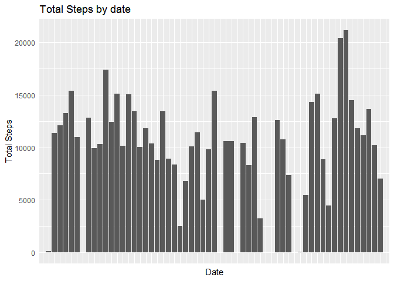
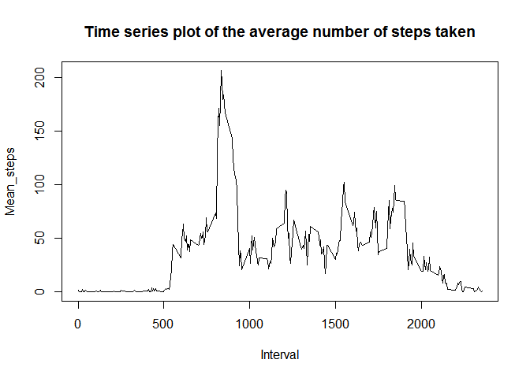
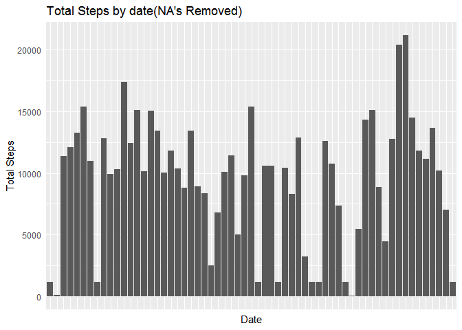
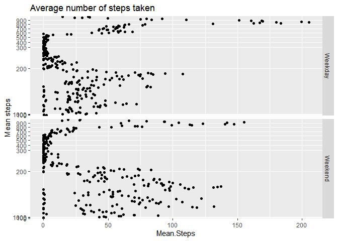

<<<<<<< HEAD
---
title: "Course Project 1 - Reproducible Research"
author: "Shinigami-Daikou"
date: "6/4/2020"
output: 
   html_document:
      keep_md: true
---


```r
knitr::opts_chunk$set(fig.path='Figs/')
```


# Step 1:
## Code for reading in the dataset and/or processing the data
 I've already fork and cloned the directory. Majority of data formatting will be done as necessary
 

```r
library(ggplot2)
unzip("activity.zip")
activity<-read.csv("activity.csv",na.strings = "NA")
activity<-transform(activity,date=as.Date(date))
```


# Step 2:
## Histogram of the total number of steps taken each day
Using the tapply to calculate the sum of steps according to date. And plotting the sum against the date


```r
q1<-data.frame(tapply(activity$steps,activity$date,sum,na.rm=TRUE))
q1$date<-rownames(q1)
names(q1)[1]<-"Total.Steps"
ggplot(q1,aes(y=Total.Steps,x=date))+geom_bar(stat="identity")+ylab("Total Steps")+xlab("Date")+ggtitle("Total Steps by date")+
   theme(  axis.text.x = element_blank(),axis.ticks = element_blank())
```

<!-- -->

# Step 3
## Mean and median number of steps taken each day
Using the tapply function to calculate both mean and median


```r
mean<-mean(activity$steps,na.rm = TRUE)
median<-median(activity$steps,na.rm=TRUE)
temp<-cbind(mean,median)
temp<-rbind(temp,c("Mean","Median"))
print(temp)
```

```
##      mean               median  
## [1,] "37.3825995807128" "0"     
## [2,] "Mean"             "Median"
```

# Step 4
## Time series plot of the average number of steps taken
Plotting average against date


```r
q3<-data.frame(tapply(activity$steps, activity$interval, mean,na.rm=TRUE))
q3$Interval<-rownames(q3)
names(q3)[1]<-"Mean"
plot(q3$Interval, q3$Mean, type = "l", main = "Time series plot of the average number of steps taken", xlab = "Interval", ylab = "Mean_steps")
```

<!-- -->


# Step 5
## The 5-minute interval that, on average, contains the maximum number of steps
Using tapply to calculate sum according to the intervals and printing the max


```r
activity$interval<-as.factor(activity$interval)
q4<-tapply(activity$steps,activity$interval,sum,na.rm=TRUE)
temp<-cbind(names(q4[q4==max(q4)]),q4[q4==max(q4)])
temp<-rbind(temp,c("Interval","Steps"))
print(as.matrix(temp))
```

```
##     [,1]       [,2]   
## 835 "835"      "10927"
##     "Interval" "Steps"
```


# Step 6
## Code to describe and show a strategy for imputing missing data
### I've imputed the missing data by the median of the same interval's data  


```r
q5<-tapply(activity$steps,activity$interval, median, na.rm=TRUE)
q6<-activity
for (i in 1:length(q6$steps)){
      if(is.na(q6$steps[i])){
            q6$steps[i]=q5[q6$interval[i]]
      }
}
```


# Step 7
## Histogram of the total number of steps taken each day after missing values are imputed
Plotting the number of steps against date again


```r
q7<-data.frame(tapply(q6$steps,q6$date,sum))
q7$date<-rownames(q7)
names(q7)[1]<-"Total.Steps"
ggplot(q7,aes(y=Total.Steps,x=date))+geom_bar(stat="identity")+ylab("Total Steps")+xlab("Date")+ggtitle("Total Steps by date(NA's Removed)")+
   theme(  axis.text.x = element_blank(),axis.ticks = element_blank())
```

<!-- -->


# Step 8
## Panel plot comparing the average number of steps taken per 5-minute interval across weekdays and weekends
Here, I've split the data into two using split function according to type of day using the factor variable I've created. Then calculating the mean and merging them again


```r
q8<-q6
q8$day<-weekdays(q8$date)
q8$day<-factor(q8$day,levels=c("Monday","Tuesday","Wednesday","Thursday",
                                             "Friday","Saturday","Sunday"))
q8$type<-as.numeric(q8$day) %in% 1:5
q9<-split(q8,q8$type)
q10_1<-with(q9[[1]],data.frame(tapply(steps, interval, mean)))
q10_2<-with(q9[[2]],data.frame(tapply(steps, interval, mean)))
q10_1$type<-"Weekend"
q10_2$type<-"Weekday"
q10_1$interval<-rownames(q10_1)
q10_2$interval<-rownames(q10_2)
q10<-rbind(q10_1,q10_2)
names(q10)[1]<-"Mean.Steps"

g <- qplot(Mean.Steps,interval, data=q10, facets = type~.)
g + geom_point() + ylab("Mean steps") + ggtitle("Average number of steps taken")+scale_y_discrete(breaks=pretty(q10$interval,n=10))
```

<!-- -->
=======
>>>>>>> 69c34eec2cdd1ad1b84af2c60c5c6d4857a62fa9
